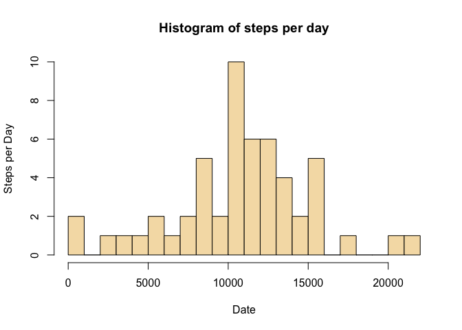
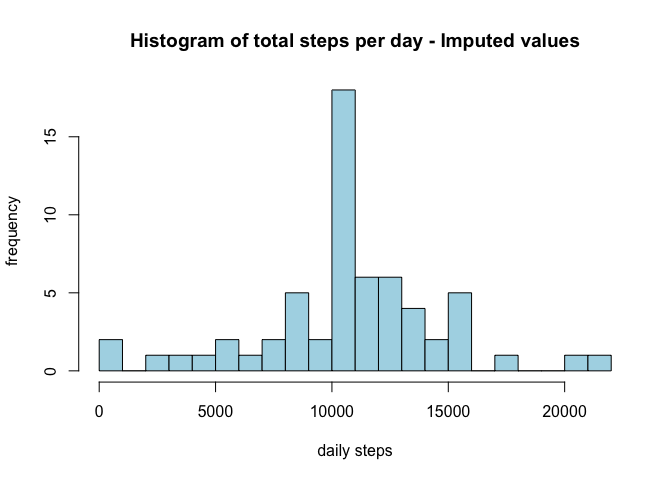
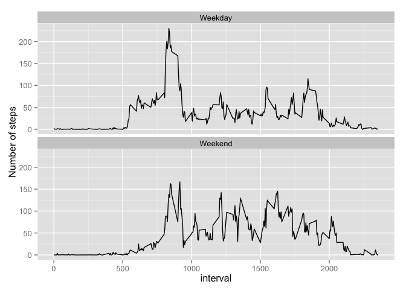

# Reproducible Research: Peer Assessment 1


### 1. Loading and preprocessing the data


```r
setwd("~/RepData_PA1_Draft")
activity <- read.csv("activity.csv")
```


```r
library(reshape2)
library(ggplot2)
```


```r
meltAct <- melt(activity, id=c("date"), na.rm=TRUE, measure.vars="steps")
dcastActv <- dcast(meltAct, date ~ variable, sum)
```


### 2. What is mean total number of steps taken per day?


```r
sum(dcastActv$steps, na.rm=TRUE)
```

```
## [1] 570608
```

2.1 Make a histogram of the total number of steps taken each day.


```r
hist(x=dcastActv$steps,
     col="wheat",
     breaks=20,
     xlab="Date",
     ylab="Steps per Day",
     main="Histogram of steps per day")
```

 

2.2 Calculate and report the mean and meadian total number of steps today.

2.2a The mean total number of steps per day.


```r
mean(dcastActv$steps, na.rm=TRUE)
```

```
## [1] 10766.19
```

```r
median(dcastActv$steps, na.rm=TRUE)
```

```
## [1] 10765
```


### 3. What is the average daily activity pattern?

3.1 Make a time series plot (i.e. type = "l") of the 5-minute interval (x-axis) and the average number 
of steps taken, averaged across all days (y-axis)


```r
meltInt <- melt(activity, 
                       id=c("interval"), 
                       na.rm=TRUE, 
                       measure.vars="steps")

castInt <- dcast(meltInt, 
                        interval ~ variable, 
                        mean)
```


3.2 Which 5-minute interval, on average across all the days in the dataset, contains the maximum number 
of steps?


```r
maxSteps <- castInt$interval[which(castInt$steps == max(castInt$steps))]
paste("Interval w/ maximum number of steps = ",maxSteps)
```

```
## [1] "Interval w/ maximum number of steps =  835"
```

```r
maxIntv <- max(castInt$steps)
paste("Maximum interval w/ mean number of steps = ", maxIntv)  
```

```
## [1] "Maximum interval w/ mean number of steps =  206.169811320755"
```

```r
plot( castInt$interval, castInt$steps, type="l", xlab="5-minute intervals",
      ylab="Aveverage steps by interval - all days")
```

 

### Imputing missing values

4.1 Calculate and report the total number of missing values in the dataset


```r
sum(is.na(activity$steps))
```

```
## [1] 2304
```

4.2 Devise a strategy for dealing with missing values

There are 2304 missing/NA values in the original dataset.The strategy for replacing missing values is to use the mean of the 5-minute interval in which the value is missing. The result will be a new dataset of the same dimension as the original dataset in which the NA values have been replaced with the mean for the internal.
The new steps in the new dataset can then be calculated and compared to the original dataset. 

4.3 create a new dataset that is equal to the original dataset but with missing values filled-in.


```r
activNa <- is.na(activity$steps)

castIntb <- cbind(castInt, as.integer(round(castInt$steps)))

activNaN <- activity[!activNa,]

naActiv <- activity[activNa,]

activImp <- merge(naActiv, castIntb, by.x = "interval", by.y = "interval", all=FALSE )

activImp$steps.x <- NULL

activImp$steps.y <- NULL

names(activImp)[3] <- paste("steps")

activImpAct <- rbind(activImp, activNaN)

meltImpAct <- melt(activImpAct, id=c("date"), na.rm=TRUE, measure.vars="steps")

dcastImpAct <- dcast(meltImpAct, date ~ variable, sum)
```


4.4 Make a histogram of the total number of steps taken each day and Calculate and report the mean and median total number of steps taken per day. 


```r
hist(dcastImpAct$steps,
     col="lightblue",
     breaks=20,
     xlab="daily steps",
     ylab="frequency",
     main="Histogram of total steps per day - Imputed values")
```

 

```r
impMean <- format(round(mean(dcastImpAct$steps), 2), nsmall = 2)

impMedian <- median(dcastImpAct$steps)
```


4.4a Do these values differ from the estimates from the first part of the assignment? 

The revised dataset containing containing the imputed values to replace missing/NA values exhibits
mean steps per day of 10766 (original = 10766) and median steps per day of 10762 (original = 10765). 
There has been no change change in the mean daily steps from the original dataset and minor change in the median number of steps.

4.4b What is the impact of imputing missing data on the estimates of the total daily number of steps?

The impact of imputing missing values using the streategy described above is that the mean and median
steps per day are now closer which indicates less variation in the numer of steps between days. 

### 5. Are there differences in activity patterns between weekdays and weekends?

5.1 Create a new factor variable in the dataset with two levels – “weekday” and “weekend” indicating 
whether a given date is a weekday or weekend day.


```r
wkday <- !(weekdays(as.Date(activImpAct$date)) %in% c('Saturday','Sunday'))

dayweek <- c("", "")

for (i in 1:length(wkday)) {
  if (wkday[i]) {dayweek[i] <- "Weekday"} else {dayweek[i] <- "Weekend"}
}

activImpAct[, "dayCat"] <- factor(dayweek)
```


5.2 Make a panel plot containing a time series plot (i.e. type = "l") of the 5-minute interval (x-axis)
and the average number of steps taken, averaged across all weekday days or weekend days (y-axis). 


```r
plot <- ggplot(activImpAct, aes(x=interval, y=steps)) + geom_line()
pmelt <- melt(activImpAct, id=c("interval", "dayCat"), na.rm=TRUE, measure.vars="steps")
pcast <- dcast(pmelt, interval + dayCat ~ variable, mean)
plot <- ggplot(pcast, aes(x=interval, y=steps)) + 
  geom_line() + 
  ylab("Number of steps")
plot + facet_wrap(~ dayCat, ncol=1)
```

 

